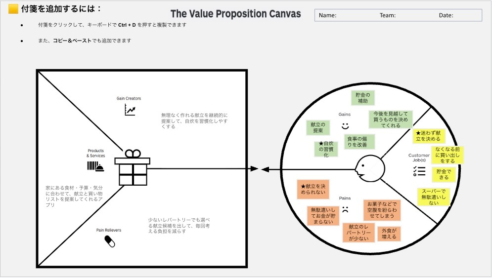

# VPC v1 - ooooottttt0486

> 「**自分や周りの人を顧客に設定**」したVPC。13週後の自分が欲しいもの・身近な人のために作りたいものを設計する。
> v1 でいい。完璧を目指さない。第6回でアップデート(v2)します。

---

## 1. 解決したい困りごとを 1つ 選ぶ

> [`bug-list.md`](./bug-list.md) の20個から、**「自分が一番これを解決したい!」と思うもの** を1つ選んでください。
> 1つに絞れなければ、複数候補を書いてOK(後で絞り込みます)。

**選んだ困りごと**:

自炊の献立を決められず、外食や無駄遣いが増えてしまうこと

---

## 2. その解決策のアイデアを書く

> 選んだ困りごとに対する「**こうだったらいいのに**」を1つ書く。
> 現実性は気にせず、自由に発想。

**解決のアイデア**:

家にある食材・予算・気分に合わせて、献立と買い物リストを提案してくれるアプリ

---

## 3. VPC本体

> 上で選んだ「困りごと」と「解決のアイデア」を起点に、6要素を埋めていきます。

### 🟦 Customer Profile(顧客=自分自身)

#### Jobs(やりたいこと・動詞で書く)

- ★迷わず献立を決める
- なくなる前に買い出しをする
- 貯金できる

#### Pains(困っていること)

- ★献立を決められない
- 無駄遣いしてお金が貯まらない
- 献立のレパートリーが少ない
- 外食が増える
- お菓子などで空腹を紛らわせてしまう

#### Gains(得たい未来・状態)

- 貯金の補助
- 献立の提案
- ★自炊の習慣化
- 食事の偏りを改善
- 今後を見越して買うものを決めてくれる

---

### 🟧 Value Map(あなたが作るもの)

#### Products & Services

- 家にある食材・予算・気分に合わせて、献立と買い物リストを提案してくれるアプリ

#### Pain Relievers

- 少ないレパートリーでも選べる献立候補を出して、毎回考える負担を減らす

#### Gain Creators

- 無理なく作れる献立を継続的に提案して、自炊を習慣化しやすくする

---

## 4. Fit確認(整合チェック)

| Pains/Gains | ↔ | Pain Relievers / Gain Creators | チェック |
|---|---|---|---|
| Pain ① (献立決め) | ↔ | Pain Reliever ① (献立候補の提示) | ✓ |
| Pain ② (無駄遣い) | ↔ | Pain Reliever ② (予算に合わせた提案) | ✓ |
| Gain ① (自炊習慣化) | ↔ | Gain Creator ① (継続的な提案) | ✓ |
| Gain ② (貯金補助) | ↔ | Gain Creator ② (買い物リスト提案) | ✓ |

> 整合しないものは「自分が作りたいだけ」のプロダクトになりがち。
> 迷ったら AI大学講師に壁打ち。
